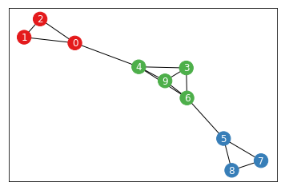

# 
Exploring Community Evolution in Temporal Networks

 

<i>
Michael Uftring 
Indiana University 
DSCI-D699-30784 - Independent Study 
Fall, 2018
</i>

 

<b>Abstract.</b>
An in depth analysis of community structure changes in temporal networks can be useful for gaining insight into why these changes occur and what impact the changes might have. For example, observing the ebb and flow of community membership over time with the effects of a diffusion process could potentially provide an understanding of the long-term dynamics of the spreading phenomena on an evolving network.
  
Computing modularity for each time-slice permits the ability to compare the community structures of adjacent temporal periods of a dynamic network. The magnitude of each community (in terms of relative size to the network as a whole at that time) in each time-slice can be visualized[1]; this shows the flow of community membership over time. Similarly, clustering similarity is computed from adjacent pairs of modularity and aggregated over the entire time-span of the network data set. This produces a measure of frustration[2] for each vertex. Frustration can be used to identify stable and unstable nodes in the network. The node stability measure, with respect to community formation and membership, can indicate which nodes are foundational group members and which are potentially "floaters" (perhaps affecting cross-community diffusion).
  
The Temporal Network Analysis (TeNA) Python package is being developed to provide analytical functions and visualization methods for these types of analysis techniques. TeNA is built upon proven Python packages: NetworkX, Numpy, Pandas, CluSim[3], and uses an implementation of the Louvain community detection algorithm[4].

# Introduction
Most real networks are not static. Network structures change over time: nodes and links are added and removed. Given this kind of flux in the compositional elements, other network structures are subject to change as as a result.

Community structures are generally formed in networks based on the links connecting nodes. Communities reflect a greater-than casual relationship amongst the grouped nodes. The structural changes that occur in networks result in changes to the community structures. As nodes and links are added and removed, the communites in a network will form, expand, contract, and dissolve. Understanding the dynamics of community structure can provide insight into the behavioral patterns and processes on the network. The objective of this project is to provide tools to aid in garnering insights from the evolution of community structure in temporal networks.

When we consider processes on networks as they execute across a span of time, we want to gain some insight into how the processes are affected by the network structure or how the process will effect change on the network structure. For example, the nature of diffusion is well understood for static networks. Observing and understanding the dynamic ebb and flow of community structures over time may provide some insight into how spreading is started, increased, decreased, or prevented in temporal networks. Ultimately we would like to use this understanding and gained insight to make predictions on processes, but this is outside the scope of the current project.

The key components of the approach presented here are:

- *Aligned Cluster Numbering*: Most clustering algorithm implementations assign nodes to numbered groups. Each numbered group represents a network community. While the clustering algorithms will not vary the membership in the groups across executions (except as possibly perturbed by their stochastic nature), the number assigned to each groups may vary. This was observed to be especially true when executing the clustering on a set of temporal slices of networks. In order to consistently analyze a sequence of communities across a span of time, we introduce a mechanism to align the cluster numbering across the entire sequence.
- *The Ebb and Flow of Community Membership*: A visualization technique which shows the temporal nature of a network from the perspective of community evolution. The communities are presented as nodes, and the links between nodes show the flow of community membership.
- *Identifying Stable Nodes*: Using an element-based clustering similarity measure[2] we can compute an overall score for each node in the network across the entire temporal span. The score will indicate stability of the node relative to its clustering (community assignment) over time. This score is also called level of frustration.

# Discussion
## Aligned Cluster Numbering
We need to be able to trace the lifecycle of community structures in temporal networks. Beyond the initial community formation (from the inaugural time-slice of the temporal network), we need to be able to observe and correlate the changes as time progresses. In order to follow each community we need a means to consistently identify the communities. We achieve this by aligning the cluster number assignments across each time-slice of the temporal network.

Aligning cluster numbering is a process of tracing ancestry. The process entails a comparison of two temporally adjacent cluster assignments and execution of a set of steps:
1. **compute grouping**: Collects group membership at a specific time. Returns a collection of the groups with their members.
2. **determine similarity**: Computes the similarity between two groups. Similarity is based on *set operations*: how much of group1 is in group2 is determined by using the set intersection operation.
3. **find contributors**: For each group, determine which of the previous groups contribute membership.
4. **determine origins**: Based on the contributors (found in the prior step), the previous group that provides the largest contribution to the current group is deemed to be the origin. In some cases there is a sole contributor. In some cases one previous group is the sole contributor to more than one current group (the previous group has split). Care is taken such that each previous group is the origin for just one current group, and all group numbering is unique in each time slice (thus mirroring the results of the actual cluster assignment).
5. **rename communities**: Based on the origins, if a current group's origin is different than its current assignment, the group is renamed.

A simple example is presented in the following figures and tables. The network consists of ten nodes observed at three points in time. At time 1, the network has two equal sized communities. At time 2, one node from each of the two original communities (nodes 4 and 9) form a third community. And at time 3, one node from each of the two original communities (nodes 3 and 6) join the third community. The nodes are colored according to their cluster assignment (0: red, 1: blue, 2: green), and the coloring is consistent across each time-slice, and in both the unaligned and aligned results.

Without aligning the cluster numbering, we observe the results presented in Figure 1 and Table 1. At time 2 we observe that the newly formed cluster (nodes 4 and 9) is assigned number 1, and the original cluster assigned 1 (nodes 5, 6, 7, and 8) is now assigned 2. Intuition tells us that cluster 1 should survive at time 2 with the four remaining nodes (5, 6, 7, and 8) and a new cluster assigned number 2 should be formed with the moving nodes (4 and 9). Figure 2 and Table 2 present these results when aligning the cluster numbering, and now the cluster numbering is more intuitive.

   
**Figure 1**: Simple Network - 3 Time-slices, Nodes Colored with Community Assignment (Unaligned)

| Node | Time 1 | Time 2 | Time 3 |
| ---- | ------ | ------ | ------ |
| 0 | 0 | 0 | 0 |
| 1 | 0 | 0 | 0 |
| 2 | 0 | 0 | 0 |
| 3 | 0 | 0 | 1 |
| 4 | 0 | 1 | 1 |
| 5 | 1 | 2 | 2 |
| 6 | 1 | 2 | 1 |
| 7 | 1 | 2 | 2 |
| 8 | 1 | 2 | 2 |
| 9 | 1 | 1 | 1 |
**Table 1**: Simple Network, Unaligned Cluster Numbering

   
**Figure 2**: Simple Network - 3 Time-slices, Nodes Colored with Community Assignment (Aligned)

| Node | Time 1 | Time 2 | Time 3 |
| ---- | ------ | ------ | ------ |
| 0 | 0 | 0 | 0 |
| 1 | 0 | 0 | 0 |
| 2 | 0 | 0 | 0 |
| 3 | 0 | 0 | 2 |
| 4 | 0 | 2 | 2 |
| 5 | 1 | 1 | 1 |
| 6 | 1 | 1 | 2 |
| 7 | 1 | 1 | 1 |
| 8 | 1 | 1 | 1 |
| 9 | 1 | 2 | 2 |
**Table 2**: Simple Network, Aligned Cluster Numbering

## The Ebb and Flow of Community Membership
Visualization of the ebb and flow of community membership in a temporal network is a helpful tool. The visualization shows how the communities form, expand, retract, and dissolve. We can clearly see the contributions and origins of each community at each time-slice, as described in *Aligned Cluster Numbering*. To visualize the flow of community membership we use Alluvial Flow Diagrams (also known as Sankey Diagrams).

Flow is computed by looking at temporally adjacent, aligned cluster numbering community membership. We determine all unique "from" and "to" combinations present in the adjoining community assignments. Then we accumulate all traffic in the appropriate from-to bucket; this produces the magnitude of each flow. The result is a directed acyclic graph (DAG) where each node represents a community and each edge represents the flow of membership traffic.

The flow visualization can be presented using three different mechanisms:
- NetworkX and Matplotlib with a directed acyclic graph layout computed using the GraphViz `dot` program
- the `ipysankeywidget`[5] Jupyter Notebook widget
- as an SVG in an HTML file using **Semiotic**[6]

The ebb and flow of community membership for the simple network presented earlier is shown in Figure 3. Each time-slice is vertically aligned in the visualization. Here we can see how group 0 (red) and group 1 (blue) contribute to group 2 (green) across two time periods. The edges in the graph show the magnitude in terms of the number of community members traveling from node to node.

   
**Figure 3**: Simple Network, Flow of Community Membership

## Clustering Similarity
Clustering similarity measures are used to indicate how similar two clustering results are. There are several different clustering similarity measures. Here we use the element-based clustering similarity measure provided by the *CluSim* Python package. This measure is useful for at least two reasons. First, it is robust to overlapping and hierarchical clusterings, and does not suffer critical biases. Second, it can give us a similarity measure for each node. With the node-granular measure computed across each temporal span, we can aggregate the values to determine overall node frustration.

Frustration is a measure of how similarly a node has been clustered between two clusterings. The aggregated frustration over the time-span of a temporal network can be an indicator of how stable a node is over time. A stable node would have a high aggregated node-granular clustering similarity value, meaning is has been clustered consistently over time. Lower values indicate that a node has not been clustered consistently over time.

Knowing node-granular clustering similarity value, or frustration, can yield some insight into the network community structures. Stable nodes may be foundational nodes for communities: these may be the nodes "with attraction" and around which the communities form. Unstable nodes, also called "floaters," tend to move from community to community. This behavior may explain the effectiveness or ineffectiveness of observed network processes like diffusion across communities.

# Primary School Temporal Network Data
From DATASET: Primary school temporal network data[7]:
> This data set contains the temporal network of contacts between the children and teachers used in the study published in BMC Infectious Diseases 2014, 14:695. The file contains a tab-separated list representing the active contacts during 20-second intervals of the data collection. Each line has the form “t i j Ci Cj”, where i and j are the anonymous IDs of the persons in contact, Ci and Cj are their classes, and the interval during which this contact was active is [ t – 20s, t ]. If multiple contacts are active in a given interval, you will see multiple lines starting with the same value of t. Time is measured in seconds.

The *Primary School Temporal Network Data*[8] provides 125,773 distinct observations (interactions, active close-contact). The observations are made across two separate time spans (days). The `t` value ranges are: day 1: 31220 to 62300, elapsed span is 31080 seconds (518 minutes =  8.63 hours), day 2: 117240 to 148120, elapsed span is 30880 seconds (514.67 minutes = 8.58 hours). The two observation periods are separated by 54940 seconds (915.67 minutes = 15.26 hours). There are 242 distinct actors (nodes), and there are 11 known categorical groups (the classes: 1A, 1B, 2A, 2B, 3A, 3B, 4A, 4B, 5A, 5B, Teachers).

The data set was split into 3600 second (1 hour) segments. From each of these temporal time-slices we discovered community structures, computed clustering similarity, and produced a visualization of the ebb and flow of the community membership. Figures 4 and 5 show the visualization of the flow. While both are presented as static images here, the visualization produced by Semiotic when viewed from its HTML file is interactive with hover annotations.

   
**Figure 4**: Primary School Data, Ebb and Flow of Community Membership (NetworkX)

   
**Figure 5**: Primary School Data, Ebb and Flow of Community Membership (Semiotic)

The element-based clustering similarity measure was used to find the stable and unstable nodes, with respect to the network community structure. The measure was computed for several different time granularities: 60, 120, 180, 240, 300, 600, 900, 1200, 1500, 1800, 2700, and 3600 seconds. The maximum and minimum values were extracted to find the least and most frustrated nodes, respectively. These correspond to the most stable and least stable nodes. The results are shown in Table 3 below.

From these results we make the following observations:
- at shorter granularities (60 - 600 seconds), where we are aggregating over many clustering similarity results in each iteration, the maximum element similarity measure is in the 0.74 - 0.84 range.
- at longer granularities (900 seconds and greater), where the number of clustering similarity results is fewer, we see notably higher maximum element similarity measures, mostly above 0.90.
- node 1715 was the most stable between 3 minute and 15 minute granularity; this might suggest that node is "popular" amongst a common set of students, but not for longer spans of time.
- nodes 1618 and 1818 are the most stable in the longer periods, suggesting that they may draw a common crowd when viewed at coarse granularities (extending over the span of an entire school day)

| Period | Max(f) | Node | Min(f) | Node |
| ------ | ------ | ---- | ------ | ---- |
| 60 | 0.808519 | 1803 | 0.511990 | 1735 |
| 120 | 0.742048 | 1854 | 0.417974 | 1799 |
| 180 | 0.741221 | 1715 | 0.426057 | 1799 |
| 240 | 0.795447 | 1715 | 0.343352 | 1799 |
| 300 | 0.848891 | 1715 | 0.405946 | 1799 |
| 600 | 0.804778 | 1715 | 0.433614 | 1480 |
| 900 | 0.874152 | 1715 | 0.356472 | 1630 |
| 1200 | 0.846276 | 1525 | 0.425809 | 1609 |
| 1500 | 0.941126 | 1618 | 0.440813 | 1511 |
| 1800 | 0.950189 | 1618 | 0.354043 | 1799 |
| 2700 | 0.926808 | 1818 | 0.415253 | 1909 |
| 3600 | 0.914815 | 1818 | 0.480021 | 1854 |

**Table 3:** Primary School Data, Most Stable and Most Unstable Nodes at Varying Temporal Granularity

# Conclusion
Aligned cluster numbering is essential for visualizing the ebb and flow of community membership.

With element-based cluster similarity measures we can gain some understanding into how and why communities in networks form, expand, retract, and dissolve, and potentially gain some insight into processes executing on the network.

# Future Work
This is an evolving body of work, for both the tool set (Python package) and learning about and analyzing temporal network data. Ideally learning activities and research will continue beyond the term of this class project, and the tool set will improve and expand its capabilities.

Areas for improvement and expansion:
- Data Set Handling: build an abstract mechanism which permits the ability to load and process diverse data sets with the TeNA package
- Data Processing: enhance API to permit specifying temporal window size (where applicable)
- Visualization: further annotate Alluvial Flow diagrams with least and most frustrated nodes in order to show community important nodes, and free floaters
- User Experience: enhance Alluvial Flow diagram presentation to permit scrolling "wide" diagrams, and zoom in / zoom out to alter temporal view
- Release: publish TeNA package on GitHub and PyPI, write technical and user docs
- Analysis: explore different temporal network data sets (UIUC research), explore network processes such as spreading phenomena
- Real-time Capabilities: stream network data into processing layer, build live updating Alluvial Flow Diagram
- Performance: make TeNA work well with small and large data sets

# References
1. M. Rosvall, C.T. Bergstrom; *Mapping Change in Large Networks*; PLOS One, January 27, 2010; https://doi.org/10.1371/journal.pone.0008694
2. A.J. Gates, I.B. Wood, W.P. Hetrick, and YY Ahn; *On comparing clusterings: an element-centric framework unifies overlaps and hierarchy*; 2018, arxiv: 1706.06136.
3. CluSim: An extended package for clustering similarity; https://github.com/Hoosier-Clusters/clusim
4. V. Blondel, J.L. Guillaume, R. Lambiotte, E. Lefebvre; *Fast unfolding of communities in large networks*; Journal of Statistical Mechanics: Theory and Experiment 2008 (10), P10008 (12pp); https://arxiv.org/abs/0803.0476
5. R. Lupton; *IPython / Jupyter Sankey diagram widget*; https://github.com/ricklupton/ipysankeywidget
6. E. Meeks, *Semiotic Visualization*, https://emeeks.github.io/semiotic/#/
7. DATASET: Primary school temporal network data, http://www.sociopatterns.org/datasets/primary-school-temporal-network-data/
8. V. Gemmetto, A. Barrat, C. Cattuto; *Mitigation of infectious disease at school: targeted class closure vs school closure*; BMC Infectious Diseases 14, 695 (2014); http://www.biomedcentral.com/1471-2334/14/695
9. V. Sekara, A. Stopczynski, and S. Lehmann; *Fundamental structures of dynamic social networks*; PNAS September 6, 2016 113 (36) 9977-9982; https://doi.org/10.1073/pnas.1602803113
